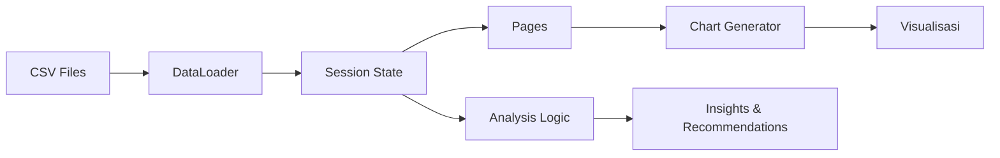

# Penjelasan Lengkap Proyek Credit Analysis Dashboard

## 🎯 Tujuan Proyek

Proyek ini adalah dashboard interaktif untuk analisis kredit yang dibangun dengan Streamlit. Dashboard ini berfungsi sebagai **copilot** untuk analis kredit, memberikan informasi yang cepat, dapat dijelaskan (explainable), dan dapat ditindaklanjuti (actionable) dari data analisis kredit yang telah diproses sebelumnya.

---

## 📁 Struktur Proyek

### Overview Struktur Folder
```
workspace/
├── app.py                    # File utama aplikasi Streamlit
├── requirements.txt          # Daftar dependensi Python
├── README.md                # Dokumentasi singkat
├── project_plan.md          # Rencana detail proyek
├── data/                    # Folder data (CSV files)
│   ├── df_credit_score.csv  # Data skor kredit utama
│   ├── df_agg.csv          # Data agregat fitur
│   ├── df_ratios.csv       # Data rasio tahunan
│   ├── company_info_sub.csv # Info perusahaan
│   ├── balance_sheet_sub.csv # Data neraca
│   ├── income_info_sub.csv  # Data laba rugi
│   └── cash_flow_sub.csv    # Data arus kas
├── utils/                   # Modul utilitas
│   ├── __init__.py
│   ├── data_loader.py       # Kelas untuk loading data
│   └── charts.py            # Kelas untuk pembuatan grafik
└── pages/                   # Halaman-halaman dashboard
    ├── __init__.py
    ├── analysis_summary.py   # Halaman ringkasan analisis
    ├── performance_insight.py # Halaman insight kinerja
    ├── ratio_explorer.py     # Halaman eksplorasi rasio
    └── financials_explorer.py # Halaman laporan keuangan
```

---

## 🏗️ Arsitektur Aplikasi

### 1. **File Utama (app.py)**
Ini adalah entry point aplikasi yang mengatur:
- Konfigurasi halaman Streamlit
- Loading data menggunakan session state
- Navigasi sidebar antar halaman
- Styling CSS global

**Logika Utama:**
```python
def load_data():
    # Memuat data sekali dan simpan di session state
    # Menghindari loading ulang data saat berganti halaman

def main():
    # Menampilkan sidebar navigasi
    # Memanggil fungsi halaman yang sesuai berdasarkan pilihan user
```

### 2. **Modul Utils (utils/)**

#### a. **data_loader.py**
Kelas `DataLoader` bertanggung jawab untuk:
- Loading semua file CSV dari folder data
- Validasi struktur data
- Menghitung kontribusi setiap aspek ke skor final
- Menyediakan bobot untuk setiap aspek (15%, 20%, dst)

**Komponen Penting:**
- `aspect_weights`: Bobot setiap aspek (Liquidity 15%, Solvency 15%, Profitability 20%, dst)
- `required_credit_columns`: Validasi kolom wajib di data kredit
- `get_aspect_contributions()`: Menghitung kontribusi masing-masing aspek

#### b. **charts.py**
Kelas `ChartGenerator` membuat semua visualisasi:
- **Radar Chart**: Menampilkan 7 skor aspek dalam bentuk radar
- **Bar Chart**: Menunjukkan skor aspek dengan warna berdasarkan status
- **Trend Charts**: Grafik garis untuk tren metrik waktu ke waktu
- **Sparklines**: Mini grafik untuk indikator tren

**Skema Warna:**
- Strong/Good: Hijau (#22c55e)
- Moderate: Kuning (#eab308)
- Watch: Oranye (#f97316)
- Weak/Poor: Merah (#ef4444)

### 3. **Halaman Dashboard (pages/)**

#### a. **analysis_summary.py**
Halaman utama yang menampilkan:
- **Skor kredit final** (tampilan besar dan prominent)
- **Radar chart** 7 aspek skor
- **Bar chart** kontribusi tertimbang
- **Breakdown per aspek** dengan analisis detail
- **Rekomendasi AI** (jika ada)

#### b. **performance_insight.py**
Halaman deep-dive metrik:
- Tabel metrik agregat (mean, std, trend)
- Pencarian dan filter metrik
- Detail analisis untuk setiap metrik
- Sparkline untuk visualisasi tren

#### c. **ratio_explorer.py**
Halaman analisis rasio detail:
- Panel rasio per kategori (Liquidity, Solvency, dst)
- Grafik tren historis per rasio
- Indikator KPI dengan arah tren
- Interpretasi otomatis berbasis aturan

#### d. **financials_explorer.py**
Halaman laporan keuangan:
- Ringkasan variabel keuangan kunci
- Tabel neraca, laba rugi, dan arus kas
- Indikator tren untuk setiap nilai
- Kemampuan ekspor data

---

## 📊 Alur Kerja Aplikasi

### 1. **Inisialisasi Aplikasi**
```mermaid
graph TD
    A[User menjalankan streamlit run app.py] --> B[Load app.py]
    B --> C[Konfigurasi page & CSS]
    C --> D[Panggil load_data()]
    D --> E[Buat DataLoader instance]
    E --> F[Load semua CSV files]
    F --> G[Validasi data]
    G --> H[Simpan di session_state]
    H --> I[Tampilkan sidebar navigasi]
```

### 2. **Session State Management**
Aplikasi menggunakan Streamlit session state untuk:
- Menyimpan data yang sudah di-load (`data_loaded`)
- Menyimpan objek DataLoader (`data_loader`)
- Menyimpan semua DataFrame (`data`)
- Menyimpan firm ID saat ini (`current_firm`)
- Menyimpan state UI (seperti toggle reasoning)

### 3. **Navigation System**
Sidebar menyediakan navigasi ke 4 halaman:
1. **Analysis Summary** - Overview skor dan visualisasi
2. **Performance Insight Deck** - Deep-dive metrik
3. **Sub-Ratio Explorer** - Detail rasio per kategori
4. **Financial Statements** - Laporan keuangan mentah

### 4. **Data Flow Pattern**


---

## 🔧 Komponen Kunci dan Cara Kerjanya

### 1. **Credit Scoring System**
Sistem menggunakan 7 aspek dengan bobot berbeda:
- **Liquidity** (15%): Kemampuan memenuhi kewajiban jangka pendek
- **Solvency** (15%): Kemampuan memenuhi kewajiban jangka panjang
- **Profitability** (20%): Kemampuan menghasilkan laba
- **Activity** (10%): Efisiensi operasional
- **Coverage** (10%): Kemampuan menutup beban bunga
- **Cashflow** (15%): Kesehatan arus kas
- **Structure** (15%): Struktur modal

**Formula Score Final:**
```
Final Score = (Liquidity Score × 0.15) +
             (Solvency Score × 0.15) +
             (Profitability Score × 0.20) +
             (Activity Score × 0.10) +
             (Coverage Score × 0.10) +
             (Cashflow Score × 0.15) +
             (Structure Score × 0.15)
```

### 2. **Data Validation**
DataLoader memvalidasi:
- Keberadaan file CSV
- Struktur kolom yang sesuai
- Tipe data yang benar
- Kelengkapan data minimal

### 3. **Chart Generation Logic**
- **Radar Chart**: 7 sumbu mewakili setiap aspek, diisi dengan skor 0-100
- **Bar Chart**: Horizontal bars diurutkan berdasarkan kontribusi ke skor final
- **Trend Charts**: Line chart untuk metrik waktu ke tahun
- **Status Coloring**: Otomatis berdasarkan status (Strong/Moderate/Watch/Weak)

### 4. **Interpretation Engine**
Menggunakan aturan berbasis:
- **Threshold values**: Batasan untuk setiap metrik
- **Trend analysis**: Analisis perubahan dari tahun ke tahun
- **Comparative analysis**: Perbandingan dengan standar industri
- **Rule-based recommendations**: Rekomendasi otomatis

---

## 💾 Data Requirements

### Struktur Data yang Diharapkan

#### 1. **df_credit_score.csv** (File Utama)
34 kolom wajib:
```
firm_id,
liquidity_score, liquidity_reason, liquidity_status,
solvency_score, solvency_reason, solvency_status,
profitability_score, profitability_reason, profitability_status,
activity_score, activity_reason, activity_status,
coverage_score, coverage_reason, coverage_status,
cashflow_score, cashflow_reason, cashflow_status,
structure_score, structure_reason, structure_status,
final_score, kategori, rekomendasi, reasoning,
liquidity_analysis, solvency_analysis, profitability_analysis,
activity_analysis, coverage_analysis, cashflow_analysis,
structure_analysis, genai_recommendation
```

#### 2. **df_agg.csv** (Data Agregat)
- ~235 kolom dengan pola `{metric}_mean`, `{metric}_std`, `{metric}_trend`
- Contoh: `roa_mean`, `roa_std`, `roa_trend`

#### 3. **df_ratios.csv** (Data Tahunan)
- ~81 kolom dengan data multi-tahun
- Kolom wajib: `firm_id`, `year`, dan berbagai rasio keuangan

#### 4. **File Support**
- **company_info_sub.csv**: Metadata perusahaan
- **balance_sheet_sub.csv**: Data neraca tahunan
- **income_info_sub.csv**: Data laba rugi tahunan
- **cash_flow_sub.csv**: Data arus kas tahunan

---

## 🚀 Cara Membangun Proyek Ini dari Nol

### Step 1: Setup Environment
```bash
# Buat folder proyek
mkdir credit_analysis_dashboard
cd credit_analysis_dashboard

# Buat virtual environment
python -m venv venv
source venv/bin/activate  # Windows: venv\Scripts\activate

# Install dependencies
pip install streamlit plotly pandas numpy python-dateutil
```

### Step 2: Buat Struktur Folder
```bash
mkdir -p utils pages data
touch __init__.py utils/__init__.py pages/__init__.py
```

### Step 3: Buat File Requirements
```bash
echo "streamlit==1.28.1
plotly==5.17.0
pandas==2.1.3
numpy==1.25.2
python-dateutil==2.8.2" > requirements.txt
```

### Step 4: Implementasikan Komponen Bertahap

#### a. **DataLoader (utils/data_loader.py)**
1. Buat class `DataLoader`
2. Implementasikan method `__init__()` dengan path dan validasi
3. Implementasikan method `load_data()` untuk load semua CSV
4. Implementasikan validasi kolom dan perhitungan kontribusi

#### b. **ChartGenerator (utils/charts.py)**
1. Buat class `ChartGenerator`
2. Definisikan skema warna untuk status mapping
3. Implementasikan method untuk setiap jenis chart:
   - `create_radar_chart()`
   - `create_aspect_bar_chart()`
   - `create_trend_chart()`
   - `create_sparkline()`

#### c. **Halaman Dashboard (pages/)**
1. **analysis_summary.py**:
   - Tampilkan skor final dengan styling prominent
   - Buat radar chart dan bar chart
   - Implementasikan breakdown per aspek dengan cards

2. **performance_insight.py**:
   - Buat tabel metrik dengan search/filter
   - Implementasikan detail panel dengan sparklines
   - Tambahkan interpretasi otomatis

3. **ratio_explorer.py**:
   - Buat panel per kategori rasio
   - Implementasikan trend charts per rasio
   - Tambahkan interpretasi berbasis aturan

4. **financials_explorer.py**:
   - Tampilkan ringkasan variabel keuangan kunci
   - Buat tabel untuk neraca, laba rugi, arus kas
   - Implementasikan indikator tren

#### d. **Main App (app.py)**
1. Konfigurasi Streamlit page
2. Tambahkan CSS styling
3. Implementasikan session state untuk data
4. Buat sidebar navigation
5. Panggil halaman yang sesuai

### Step 5: Styling dan UX
1. Tambahkan CSS untuk:
   - Metric cards dengan shadow dan border
   - Color coding untuk status
   - Responsive layout
   - Typography yang konsisten

### Step 6: Testing dan Debugging
1. Test dengan sample data
2. Validasi semua visualisasi
3. Cek navigasi antar halaman
4. Test edge cases (missing data, invalid formats)

### Step 7: Data Preparation
1. Siapkan file CSV sesuai struktur
2. Pastikan semua kolom wajib ada
3. Validasi tipe data
4. Test dengan real data

---

## 🔍 Logika Bisnis dan Algoritma

### 1. **Scoring Algorithm**
```
Untuk setiap aspek (Liquidity, Solvency, etc.):
1. Hitung skor dasar (0-100) dari rasio keuangan
2. Tentukan status (Strong/Moderate/Watch/Weak) berdasarkan threshold
3. Generate alasan dan analisis tekstual
4. Kalikan dengan bobot untuk kontribusi ke skor final
```

### 2. **Status Classification**
- **Strong**: Skor > 75, metrik di atas standar industri
- **Moderate**: Skor 50-75, metrik mendekati standar
- **Watch**: Skor 25-50, metrik di bawah standar
- **Weak**: Skor < 25, metrik sangat rendah

### 3. **Trend Analysis**
```
Untuk setiap metrik:
1. Hitung perubahan tahun ke tahun
2. Hitung persentase perubahan
3. Tentukan arah tren (Naik/Turun/Stabil)
4. Generate interpretasi tekstual
```

### 4. **Contribution Calculation**
```
Kontribusi Aspek = Skor Aspek × Bobot Aspek
Total Skor = Σ(Kontribusi semua aspek)
```

---

## 🎨 Design Principles

### 1. **Visual Hierarchy**
- Skor final menggunakan font size terbesar
- Informasi penting menggunakan warna dan positioning
- Secondary information menggunakan ukuran lebih kecil

### 2. **Color Psychology**
- Hijau untuk kondisi baik (Strong)
- Kuning untuk waspada (Moderate)
- Oranye untuk perhatian (Watch)
- Merah untuk berbahaya (Weak)

### 3. **Information Density**
- Balance antara detail dan readability
- Gunakan collapsible sections untuk informasi panjang
- Prioritaskan insight penting di atas

### 4. **Interactivity**
- Hover tooltips untuk detail tambahan
- Clickable elements untuk navigasi
- Real-time updates untuk filter dan search

---

## 🔮 Extensibility dan Future Enhancements

### 1. **Multi-Firm Support**
- Tambahkan firm selector dropdown
- Implementasikan comparison mode
- Benchmarking antar perusahaan

### 2. **Advanced Analytics**
- Machine learning models untuk prediksi
- Sentiment analysis untuk qualitative data
- Monte Carlo simulation untuk risk assessment

### 3. **Export Capabilities**
- PDF generation untuk reports
- Excel export dengan formatting
- API endpoints untuk integrasi

### 4. **Real-time Data**
- Database integration
- Automatic data refresh
- Live dashboard updates

---

## 📝 Best Practices yang Diterapkan

### 1. **Code Organization**
- Separation of concerns (utils, pages, main)
- Consistent naming conventions
- Modular and reusable components

### 2. **Data Handling**
- Proper validation and error handling
- Session state untuk performance
- Type hints untuk clarity

### 3. **User Experience**
- Loading states untuk data processing
- Error messages yang user-friendly
- Responsive design untuk berbagai screen sizes

### 4. **Maintainability**
- Clear documentation
- Consistent code style
- Easy to extend architecture

---

Dengan memahami struktur dan logika di atas, pembaca seharusnya dapat mereplikasi proyek ini tanpa perlu melihat code secara detail, karena setiap komponen memiliki tujuan yang jelas dan alur kerja yang logis. Proyek ini dirancang dengan prinsip **modularity**, **scalability**, dan **maintainability** untuk memudahkan pengembangan di masa depan.